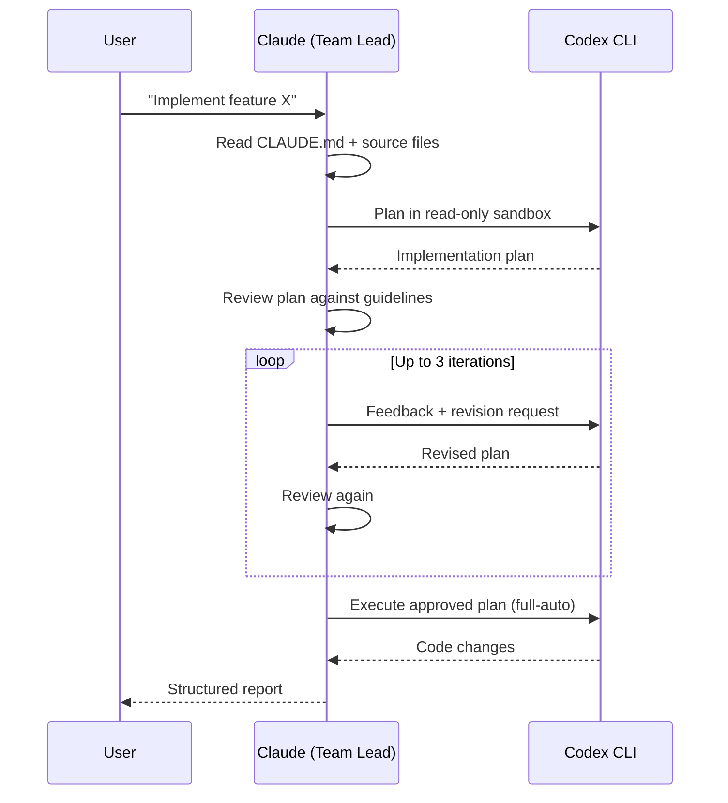
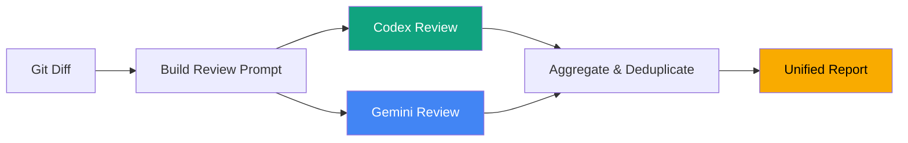

# codex-coder

> A [Claude Code](https://docs.anthropic.com/en/docs/claude-code) plugin that lets you use OpenAI Codex as a coding agent inside Claude Code.

Install this plugin and you get two new Claude Code agents and a slash command. The agents call out to the [Codex CLI](https://github.com/openai/codex) (and optionally the [Gemini CLI](https://github.com/google/gemini-cli)) to do the actual work — Claude Code orchestrates everything.

## Why

Claude Code has the best agentic scaffolding — subagents, agent teams, structured workflows, codebase-aware context building. Codex is great at raw code generation. But right now you have to pick one or the other.

This plugin gives you both. Claude reads your codebase, builds context from your CLAUDE.md, crafts detailed prompts, reviews Codex's plans, sends feedback, and only lets Codex execute once the plan is solid. You get Claude's orchestration with Codex's code output.

**No extra API keys or subscriptions.** The plugin shells out to the Codex CLI and Gemini CLI directly. If you already have them installed and authenticated, this just works — it uses whatever auth you already have set up.

## What You Get

This plugin installs into your `~/.claude/` directory and adds:

| What | Claude Code primitive | Description |
|------|-----------------------|-------------|
| `agents/codex-coder.md` | [Custom agent](https://docs.anthropic.com/en/docs/claude-code/custom-agents) | Delegates coding tasks to Codex with iterative plan-review loops |
| `agents/ai-reviewer.md` | [Custom agent](https://docs.anthropic.com/en/docs/claude-code/custom-agents) | Runs code review through Codex (and Gemini if you have it) before PRs |
| `commands/codex-review.md` | [Slash command](https://docs.anthropic.com/en/docs/claude-code/slash-commands) | `/codex-review` — quick trigger for pre-PR review |

## How It Works

### Coding: Plan-Review Loop

You give Claude a task. Claude gathers context from your project, then sends Codex a detailed planning prompt in a read-only sandbox. Claude reviews the plan against your project guidelines, sends feedback, and iterates until the plan is solid. Only then does Codex get write access to execute.



### Code Review: Codex + Optional Gemini

Before a PR, the reviewer agent captures your diff, builds a rich prompt with project context, and sends it to Codex for review. If you also have the Gemini CLI installed, it runs both reviewers in parallel and deduplicates findings — issues flagged by both get marked HIGH CONFIDENCE. If you don't have Gemini, it just runs Codex alone. No config changes needed either way.



## Prerequisites

| Tool | Required | Why | Install |
|------|----------|-----|---------|
| [Claude Code](https://docs.anthropic.com/en/docs/claude-code) | Yes | Orchestration layer | `npm install -g @anthropic-ai/claude-code` |
| [Codex CLI](https://github.com/openai/codex) | Yes | Code generation + review | `npm install -g @openai/codex` then `codex auth` |
| [Gemini CLI](https://github.com/google/gemini-cli) | No | Second reviewer (optional) | `npm install -g @google/gemini-cli` |

The agents auto-detect what's installed. If Codex is missing, they stop and tell you how to set it up. If Gemini is missing, the reviewer just runs Codex alone — no errors, no degraded experience, just one reviewer instead of two.

**You don't need separate API keys for this plugin.** It calls the CLIs directly, so whatever authentication you already have set up for Codex and Gemini is what it uses.

## Installation

```bash
# Add the marketplace
claude plugin marketplace add rlraymondluo/codex-coder

# Install the plugin
claude plugin install codex-coder
```

Or clone directly:

```bash
cd ~/.claude/plugins
git clone https://github.com/rlraymondluo/codex-coder.git
```

## Usage

### Delegate a coding task to Codex

```
Use the codex-coder agent to implement the new authentication middleware.
Read the existing middleware patterns first, then have Codex plan and execute.
```

Claude will:
1. Gather project context from CLAUDE.md and source files
2. Send Codex a detailed planning prompt (read-only sandbox)
3. Review the plan, send feedback, iterate up to 3 times
4. Execute the approved plan (full-auto mode)
5. Return a structured report with changes and iteration metadata

### Run a pre-PR code review

```
/codex-review
```

This will:
1. Capture the git diff of your changes
2. Build a review prompt with project context
3. Run Codex (and Gemini, if installed) as reviewers
4. Produce a unified report with CRITICAL / IMPORTANT / SUGGESTION findings

### Make it automatic

Add this to your project's `CLAUDE.md` to trigger reviews before every PR:

```markdown
## Code Review (MANDATORY)
- **Before creating any PR**: ALWAYS run the `ai-reviewer` agent for code review
- **For medium/large coding tasks**: Use the `codex-coder` agent with plan-review loop
```

## Configuration

### Models

The agents use these models by default:

| Agent | CLI | Default Model |
|-------|-----|---------------|
| codex-coder | Codex | `gpt-5.3-codex` |
| ai-reviewer | Codex | `gpt-5.3-codex` |
| ai-reviewer | Gemini | `gemini-3-pro-preview` |

To change models, edit the `-m <model>` flags in the agent markdown files.

### Default branch

The ai-reviewer uses `codex review --base main` for PR reviews. If your default branch is different, update the `--base` flag in `agents/ai-reviewer.md`.

## Example Output

```
## Dual AI Code Review Results

### CRITICAL (must fix before merge)
1. **SQL injection in user query** — `src/db/users.ts:42`
   - Reviewer(s): Both (HIGH CONFIDENCE)
   - Raw string interpolation in SQL query
   - Fix: Use parameterized queries

### IMPORTANT (strongly recommended)
1. **Missing error handling** — `src/api/auth.ts:15`
   - Reviewer(s): Codex
   - Token refresh can throw but isn't caught
   - Fix: Wrap in try/catch with retry logic

### SUGGESTIONS (nice to have)
1. **Unused import** — `src/utils/helpers.ts:3`
   - Reviewer(s): Gemini
   - `lodash` imported but never used
   - Fix: Remove the import

---
### Review Sources
- Codex (gpt-5.3-codex): 5 findings
- Gemini (gemini-3-pro-preview): 4 findings
- Overlapping (high confidence): 2 findings
```

## License

MIT — see [LICENSE](LICENSE) for details.
