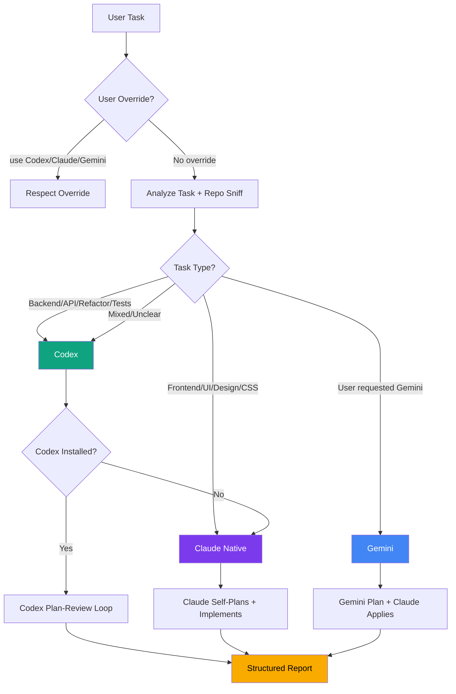
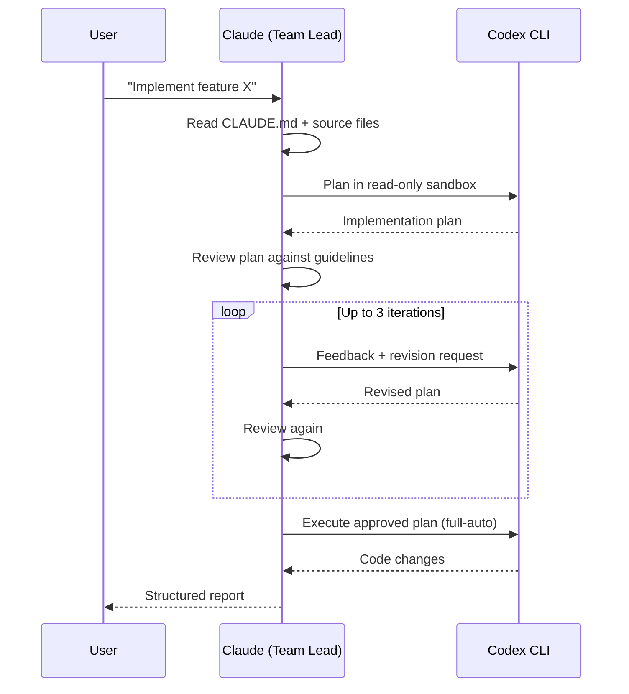
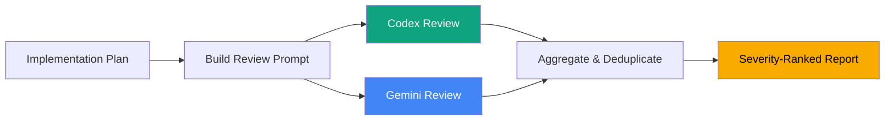
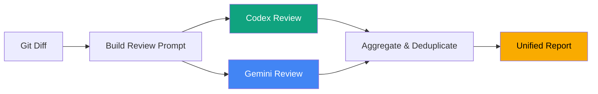

# Agent Crew for Claude Code


> Route coding tasks to the best AI. Review code and plans with two AI reviewers at once. One plugin, zero config.

**Agent Crew** gives Claude Code access to Codex and Gemini as backends — it picks the right one for each task, runs structured plan-review loops, and returns unified reports. All from inside your terminal.

```bash
claude plugin install agent-crew
```

## Quick Start

```bash
# Route a coding task to the best AI
/crew-code Add authentication middleware to the Express API

# Review your code with two AI reviewers before a PR
/crew-review

# Get your implementation plan reviewed by Codex + Gemini
/crew-plan
```

<p align="center">
  
</p>

## Install

Requires [Claude Code](https://docs.anthropic.com/en/docs/claude-code). [Codex CLI](https://github.com/openai/codex) is recommended. [Gemini CLI](https://github.com/google/gemini-cli) is optional.

```bash
# Via plugin marketplace
claude plugin marketplace add rlraymondluo/agent-crew-for-claude-code
claude plugin install agent-crew
```

Or clone directly:

```bash
cd ~/.claude/plugins
git clone https://github.com/rlraymondluo/agent-crew-for-claude-code.git
```

**No extra API keys.** The plugin calls the CLIs directly — it uses whatever auth you already have set up for Codex and Gemini. If neither CLI is installed, `crew-code` falls back to Claude natively.

## Why

Claude Code has the best agentic scaffolding — subagents, agent teams, structured workflows, codebase-aware context building. Codex is great at raw code generation. Gemini brings a different perspective for reviews. But right now you have to pick one or the other.

This plugin gives you all three. The Crew agents analyze your task, pick the best backend, gather project context, run structured plan-review loops, and return detailed reports. You get Claude's orchestration with the best tool for each job.

## What You Get

This plugin installs into your `~/.claude/` directory and adds:

| What | Claude Code primitive | Description |
|------|-----------------------|-------------|
| `agents/crew-code.md` | [Custom agent](https://docs.anthropic.com/en/docs/claude-code/custom-agents) | Smart coding router — routes to Codex, Claude, or Gemini |
| `agents/crew-plan.md` | [Custom agent](https://docs.anthropic.com/en/docs/claude-code/custom-agents) | Bounces implementation plans off Codex + Gemini for independent review |
| `agents/crew-review.md` | [Custom agent](https://docs.anthropic.com/en/docs/claude-code/custom-agents) | Dual code review through Codex (and Gemini if available) before PRs |
| `agents/codex-coder.md` | [Custom agent](https://docs.anthropic.com/en/docs/claude-code/custom-agents) | Direct Codex access — plan-review loop without routing |
| `commands/crew-code.md` | [Slash command](https://docs.anthropic.com/en/docs/claude-code/slash-commands) | `/crew-code` — route a coding task to the best backend |
| `commands/crew-plan.md` | [Slash command](https://docs.anthropic.com/en/docs/claude-code/slash-commands) | `/crew-plan` — get independent plan review from Codex + Gemini |
| `commands/crew-review.md` | [Slash command](https://docs.anthropic.com/en/docs/claude-code/slash-commands) | `/crew-review` — quick trigger for pre-PR review |

## How It Works

### Smart Routing (Crew Code)

The `crew-code` agent analyzes your task and routes to the best backend. It does a lightweight repo sniff, checks for user overrides, and picks the right tool:



### Coding: Plan-Review Loop

When routed to Codex (via `crew-code` or `codex-coder` directly), Claude gathers context from your project, then sends Codex a detailed planning prompt in a read-only sandbox. Claude reviews the plan against your project guidelines, sends feedback, and iterates until the plan is solid. Only then does Codex get write access to execute.



### Plan Review (Crew Plan)

The `crew-plan` agent sends your implementation plan to both Codex and Gemini for independent review, then aggregates and deduplicates findings:



### Code Review (Crew Review)

Before a PR, the reviewer agent captures your diff, builds a rich prompt with project context, and sends it to Codex for review. If you also have the Gemini CLI installed, it runs both reviewers in parallel and deduplicates findings — issues flagged by both get marked HIGH CONFIDENCE. If you don't have Gemini, it just runs Codex alone. No config changes needed either way.



## Usage

### Route a coding task (recommended)

```
Use the crew-code agent to implement the new authentication middleware.
```

Or use the slash command:

```
/crew-code
```

The `crew-code` agent will:
1. Analyze the task and detect signals (backend API, frontend design, etc.)
2. Check CLI availability and route to the best backend
3. Gather project context from CLAUDE.md and source files
4. Execute with the selected backend's workflow (plan-review loop for Codex, self-plan for Claude, CLI-plan for Gemini)
5. Return a structured report with routing metadata and changes

### Delegate directly to Codex

```
Use the codex-coder agent to implement the new authentication middleware.
Read the existing middleware patterns first, then have Codex plan and execute.
```

Use `codex-coder` when you want to bypass routing and go straight to Codex.

### Review a plan

```
/crew-plan
```

This will:
1. Send your implementation plan to Codex (and Gemini, if installed)
2. Get independent feedback from each reviewer
3. Aggregate findings with HIGH CONFIDENCE for overlapping issues
4. Support iterative refinement if you revise the plan

### Run a pre-PR code review

```
/crew-review
```

This will:
1. Capture the git diff of your changes
2. Build a review prompt with project context
3. Run Codex (and Gemini, if installed) as reviewers
4. Produce a unified report with CRITICAL / IMPORTANT / SUGGESTION findings

### Make it automatic

Add this to your project's `CLAUDE.md` to trigger Crew agents automatically:

```markdown
## Crew Integration (MANDATORY)
- **Before creating any PR**: ALWAYS run the `crew-review` agent for code review
- **For medium/large coding tasks**: ALWAYS use the `crew-code` agent (routes to best backend)
- **When creating implementation plans**: Send to `crew-plan` for independent review
- These rules apply to all agents, including teammates in agent teams
- Quick review trigger: `/crew-review`
```

## Configuration

### Models

The agents use these models by default:

| Agent | CLI | Default Model |
|-------|-----|---------------|
| crew-code | Codex | `gpt-5.3-codex` |
| crew-code | Gemini | `gemini-3-pro-preview` |
| crew-plan | Codex | `gpt-5.3-codex` |
| crew-plan | Gemini | `gemini-3-pro-preview` |
| crew-review | Codex | `gpt-5.3-codex` |
| crew-review | Gemini | `gemini-3-pro-preview` |
| codex-coder | Codex | `gpt-5.3-codex` |

To change models, edit the `-m <model>` flags in the agent markdown files.

### Default branch

The `crew-review` agent uses `codex review --base main` for PR reviews. If your default branch is different, update the `--base` flag in `agents/crew-review.md`.

## Example Output

### Crew Code Report

```
## Crew Code Report

### Routing
- **Backend**: Codex
- **Signals detected**: backend API task, Express.js project, no UI components
- **Reason**: Backend API implementation — routing to Codex

### Plan-Review Summary
- **Iterations**: 2/3 — plan approved on second revision
- **Key feedback given**:
  - Missing input validation on request body
  - Should use existing error handler middleware

### Changes Made
- `src/routes/users.ts`: Added GET /users/:id endpoint with validation
- `src/middleware/auth.ts`: Added role-based access check
```

### Crew Review Report

```
## Dual AI Code Review Results

### CRITICAL (must fix before merge)
1. **SQL injection in user query** — `src/db/users.ts:42`
   - Reviewer(s): Both (HIGH CONFIDENCE)
   - Raw string interpolation in SQL query
   - Fix: Use parameterized queries

### IMPORTANT (strongly recommended)
1. **Missing error handling** — `src/api/auth.ts:15`
   - Reviewer(s): Codex
   - Token refresh can throw but isn't caught
   - Fix: Wrap in try/catch with retry logic

### SUGGESTIONS (nice to have)
1. **Unused import** — `src/utils/helpers.ts:3`
   - Reviewer(s): Gemini
   - `lodash` imported but never used
   - Fix: Remove the import

---
### Review Sources
- Codex (gpt-5.3-codex): 5 findings
- Gemini (gemini-3-pro-preview): 4 findings
- Overlapping (high confidence): 2 findings
```

## License

MIT — see [LICENSE](LICENSE) for details.
